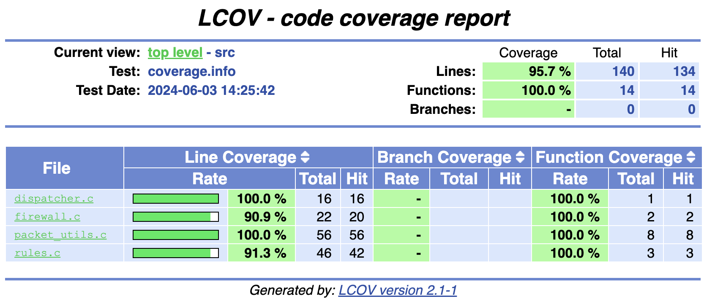

# 🔐 Firewall Prototype

## Описание

Этот проект реализует прототип файрвола на языке C. Программа читает информацию о пакетах из стандартного ввода и на основании заданных правил выносит вердикт.

> Ключевые параметры среды разработки проекта:<br>
> 


<p align="center">
    
    <br>
    Покрытие кода
</p>

## Структура проекта

```
firewall/
├── config/          # Конфигурационные файлы
│   ├── CPPLINT.cfg
│   └── rules.txt    # Файл с правилами файерволла
├── coverage/        # Отчеты о покрытии кода
│   └── report/
├── deploy/          # Исполняемые файлы для развертывания
├── input_files/     # Входные файлы для тестирования
│   └── input.txt    
├── src/             # Исходные файлы
│   ├── main.c
│   └── firewall.c
├── tests/           # Тестовые файлы
│   └── test_firewall.c
├── build/           # Собранные объектные файлы и исполняемые файлы
├── .gitignore       # Файл для исключения из системы контроля версий
├── Makefile         # Makefile для сборки проекта
└── README.md        # Описание проекта
```

## Флаги командной строки

Программа поддерживает следующие флаги командной строки:

>`-r` или `--rules`: Этот флаг указывает программе вывести информацию о используемых правилах файервола. Пример использования:
```sh
./deploy/firewall -r
```
```
Total rules: 8
Rule   Source/Prefix          Destination/Prefix     Protocol   Verdict 
1      10.0.1.11      /32  =>  1.1.1.1        /32      TCP      ACCEPT  
2      10.0.2.12      /32  =>  1.1.1.1        /32      TCP      DROP    
3      10.0.2.12      /32  =>  8.8.8.8        /32      TCP      ACCEPT  
4      10.0.3.13      /32  =>  0.0.0.0        /0       ANY      ACCEPT  
5      0.0.0.0        /0   =>  1.2.3.4        /32      UDP      DROP    
6      0.0.0.0        /0   =>  1.2.3.4        /32      ANY      ACCEPT  
7      0.0.0.0        /0   =>  10.0.9.1       /32      TCP      DROP    
8      10.0.5.0       /24  =>  0.0.0.0        /0       ANY      ACCEPT
```

## Makefile

### Основные цели

- `all`: Очистка, сборка, тестирование и развертывание.
- `run`: Запуск программы после сборки.
- `build`: Сборка всех объектных файлов и основного исполняемого файла.
- `test`: Сборка и запуск тестов.
- `deploy`: Размещение собранных файлов в директории **deploy**.
- `coverage`: Генерация отчета о покрытии кода.
- `check`: Проверка кода на утечки памяти и соответствие стилю.
- `clean`: Очистка директории сборки и отчетов о покрытии кода.

### Примеры использования

1. Сборка проекта:
```sh
make
```

2. Запуск программы:
```sh
make run
```
3. Запуск тестов:
```sh
make test
```

4. Генерация отчета о покрытии кода:
```sh
make coverage
```

5. Проверка кода:
```sh
make check
```

6. Очистка временных файлов и директорий
```sh
make clean
```
